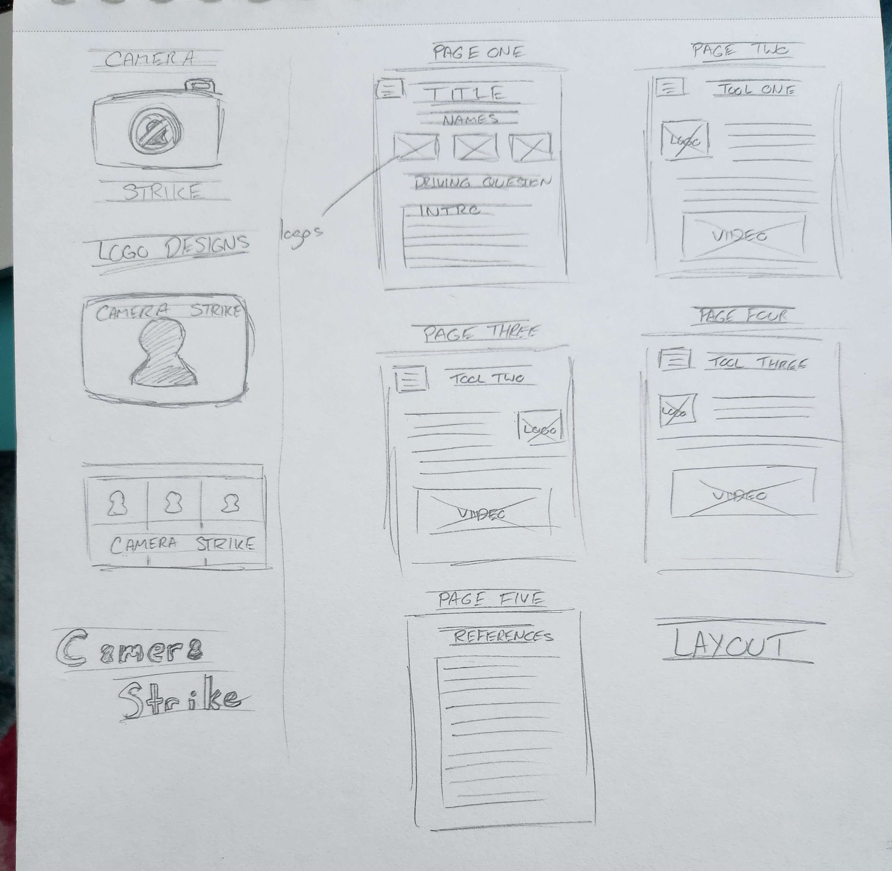

# Camera Strike

## Summary

With online class's becoming more and more common, the use of pen and pencil is rapidal being replaced with digitals tools. Unfortunately not all digital tools are helpful, and accessible for the average user. With paywalls, confusing and /or broken features It can be come pretty hard to find useful tools for individual work, much less group work. So we at cameraStrike have put together of a list of three tools we think you should get formilar with. 

You can vist the finished website here [here](https://sw33ws.github.io/Camera-Strike/)

## Table of Contents

- [Installation](#installation)
- [Usage](#usage)
- [Contact](#contact-info)

---
 
---

## Installation

Clone the repo onto your local drive, ```git clone git@github.com:sw33ws/Camera-Strike.git```

## Usage

First open it in vs code, then open it in the your browser, with a addon like ```open in browser, by TechER```.

## Contact Info

Todo add better contact info

- https://github.com/sw33ws
- https://github.com/FrostyOnyx
- https://github.com/luckyorangecat
